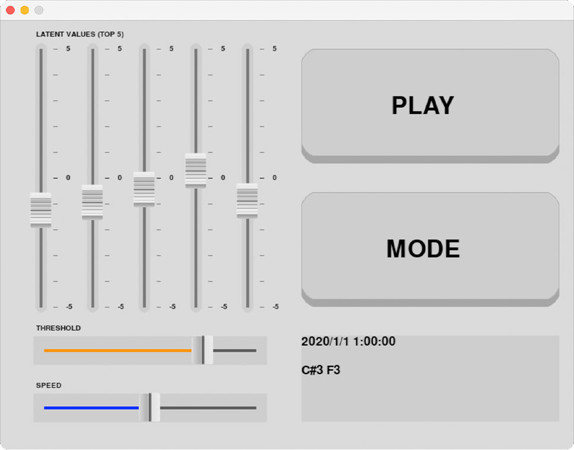

# ACKNOWLEDGEMENTS
This program is another interface of [Neural Composer](https://github.com/HackerPoet/Composer), and I was modifying this tool as a data sonification tool. 
I wish acknowledge to @HackerPoet for the excellent implementation.

# DESCRIPTION
### Before you go!
Download files from the link: https://drive.google.com/drive/folders/1eOVYzTEaIhBGPmUB-nzODhTo-q5mbMqf?usp=sharing

## NAVIGATION

SLIDERS - Associated with five meteorological data params as follows:
1. Major / Minor scales - Temperature
2. Sharp / Non-sharp notes - Dew Point Temperature
3. Triple / Quadruple metre - Relative Humidity
4. Triple / Quadruple metre - Wind Velocity
5. High / Low octave notes - Vapor Pressure

THRESHOLD - Notes probability

SPEED - Beats Per Minute (from 60 (left) to 240 (right))

MODE - Toggles Manual / Sonification mode

## DEMO
The demonstration video is available on [YouTube](https://youtu.be/Zxf24t4s4YY)
